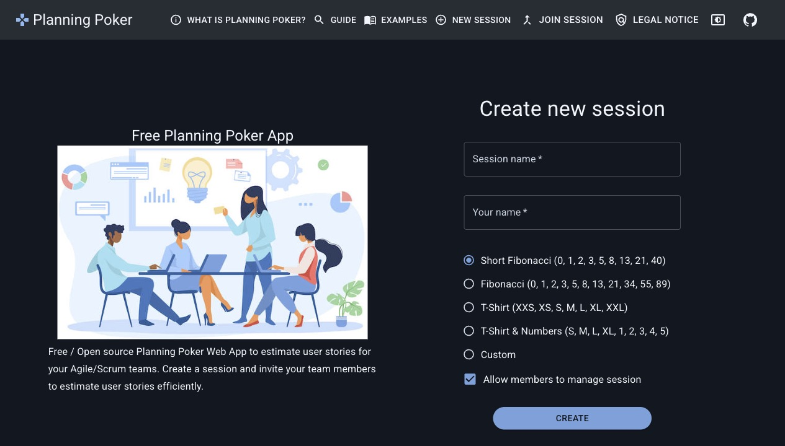
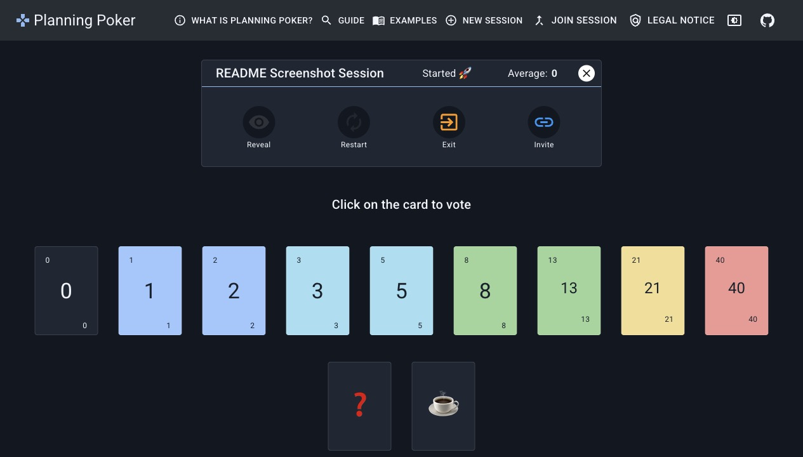

# Planning Poker

Planning Poker is a free, open-source web application for Scrum and Agile teams to estimate user stories collaboratively. A moderator creates a session, invites participants, collects hidden votes, reveals estimates when the team is ready, and resets the session for the next story.

[](https://github.com/rfoerthe/planning-poker/actions/workflows/build-and-tests.yml)

## Screenshots





## Highlights

- Create and join estimation sessions.
- Use Short Fibonacci, Fibonacci, T-shirt, T-shirt and number, or custom card decks.
- Share invite links with participants.
- Show voting progress without revealing estimates early.
- Reveal votes and calculate numeric averages.
- Reset sessions for additional rounds.
- Remove participants and delete completed sessions.
- Support multiple locales through translation files.

## Tech Stack

- React 19
- TypeScript
- Vite
- Material UI
- Firebase Firestore
- i18next
- Vitest and Testing Library
- Firebase Hosting and optional Docker/Nginx runtime

## Quick Start

```bash
pnpm install
cp .env.example .env
pnpm run dev
```

Then open:

```text
http://localhost:5173
```

Update `.env` with Firebase project values before testing real Firestore-backed sessions. See [Setup & Installation](docs/setup-installation.md) for the complete local, Docker, and Firebase setup.

## Documentation

| Document | Description |
| --- | --- |
| [Documentation Index](docs/README.md) | Map of the documentation set and documentation standards. |
| [Project Overview](docs/project-overview.md) | Product purpose, scope, audiences, goals, and key terms. |
| [Technical Architecture](docs/technical-architecture.md) | Components, data flow, Firestore structure, and internal service APIs. |
| [Setup & Installation](docs/setup-installation.md) | Local setup, environment variables, testing, builds, Docker, and Firebase Hosting. |
| [Standard Operating Procedures](docs/standard-operating-procedures.md) | Contribution, testing, deployment, release, maintenance, and incident workflows. |
| [User & Admin Manual](docs/user-admin-manual.md) | User, moderator, and admin workflows for Planning Poker sessions. |

## Common Commands

```bash
pnpm run dev      # Start the Vite development server
pnpm test         # Run tests
pnpm lint         # Run ESLint
pnpm build        # Build production assets
pnpm preview      # Preview the production build on port 5000
```

## Contributing

Planning Poker welcomes focused improvements, bug fixes, documentation updates, and feature work aligned with the project scope. Before opening a pull request, run linting, tests, and a production build.

For the full workflow, see [Standard Operating Procedures](docs/standard-operating-procedures.md).

## License

This project is licensed under the terms in [LICENSE](LICENSE).
