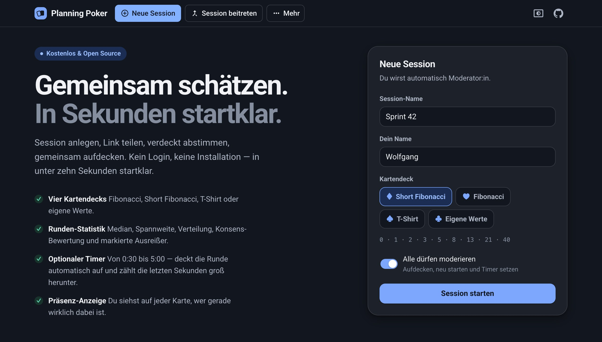
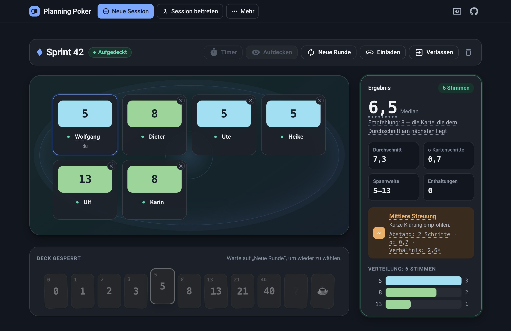

# Planning Poker

Planning Poker is a free, open-source web application for Scrum and Agile teams to estimate user stories collaboratively. A moderator creates a session, invites participants, collects hidden votes, reveals estimates when the team is ready, and resets the session for the next story.

[](https://github.com/rfoerthe/planning-poker/actions/workflows/build-and-tests.yml)

## Screenshots





## Highlights

- Create and join estimation sessions.
- Use Short Fibonacci, Fibonacci, T-shirt, or custom card decks.
- Share invite links with participants.
- Show voting progress without revealing estimates early.
- Reveal votes and read the result off a single summary card.
- Analyse revealed numeric rounds with median, range, vote distribution, the nearest matching card, a consensus rating, and highlighted outliers.
- Run an optional round timer (0:30 to 5:00) that reveals the votes automatically and shows a full-screen countdown for the last ten seconds.
- See who is currently taking part through a presence indicator on each participant card.
- Reset sessions for additional rounds.
- Remove participants and delete completed sessions.
- Use the German UI with bundled translations and light, dark, or system theme preferences.
- Administer stored sessions from the command line: list, lock, unlock, and delete them.

## Tech Stack

- React 19
- TypeScript
- Vite
- Material UI
- Firebase Firestore
- i18next
- Vitest and Testing Library
- Firebase Hosting and optional Docker/Nginx runtime

## Quick Start

Use a current Node 22.x release (at least 22.13.0) and the pinned `pnpm@11.1.1`; see the setup guide for requirements.

```bash
pnpm install
cp .env.example .env
pnpm run dev
```

Then open:

```text
http://localhost:5173
```

Update `.env` with Firebase project values before testing real Firestore-backed sessions. See [Setup & Installation](docs/setup-installation.md) for the complete local, Docker, and Firebase setup.

## Documentation

| Document | Description |
| --- | --- |
| [Changelog](CHANGELOG.md) | Released versions and their user-facing changes. |
| [Documentation Index](docs/README.md) | Map of the documentation set and documentation standards. |
| [Project Overview](docs/project-overview.md) | Product purpose, scope, audiences, goals, and key terms. |
| [Technical Architecture](docs/technical-architecture.md) | Components, data flow, Firestore structure, and internal service APIs. |
| [Setup & Installation](docs/setup-installation.md) | Local setup, environment variables, testing, builds, Docker, and Firebase Hosting. |
| [Standard Operating Procedures](docs/standard-operating-procedures.md) | Contribution, testing, deployment, release, maintenance, and incident workflows. |
| [User & Admin Manual](docs/user-admin-manual.md) | User, moderator, and admin workflows for Planning Poker sessions. |

## Common Commands

```bash
pnpm run dev      # Start the Vite development server
pnpm test         # Run application and deploy-script tests
pnpm lint         # Run ESLint
pnpm typecheck    # Run the TypeScript compiler without emitting output
pnpm build        # Build production assets
pnpm preview      # Preview the production build on port 5000
```

### Firebase Deployment

Configure `.env` and authenticate with `pnpm exec firebase login`, then run `pnpm run deploy` for Hosting or `pnpm run preview-deploy` for a 14-day preview channel. Both commands clean and build the app, then deploy to `VITE_FB_PROJECT_ID` from the loaded environment. No `.firebaserc` is needed. See [Firebase Hosting Setup](docs/setup-installation.md#firebase-hosting-setup) for environment precedence and preview behavior.

### Maintenance Scripts

These scripts talk to the Firestore project configured in `.env`, using the Firebase web SDK and the same project configuration and Firestore rules as the app. They do not use a service account or bypass access rules.

```bash
pnpm games:list                  # List all sessions (locked ones last); --json for machine-readable output
pnpm games:lock <document-id>    # Protect a session against deletion (isLocked: true)
pnpm games:unlock <document-id>  # Allow a session to be deleted again (isLocked: false)
pnpm games:delete <id> [<id>...] # Delete sessions and their participants; asks for confirmation, skips locked ones
```

The lock protects against the normal app deletion flow and `games:delete`. Sessions are not automatically deleted based on age; see [Session Data Maintenance](docs/standard-operating-procedures.md#sop-session-data-maintenance).

## Contributing

Planning Poker welcomes focused improvements, bug fixes, documentation updates, and feature work aligned with the project scope. Before opening a pull request, run linting, type checking, tests, and a production build.

For the full workflow, see [Standard Operating Procedures](docs/standard-operating-procedures.md).

## License

This project is licensed under the terms in [LICENSE](LICENSE).
