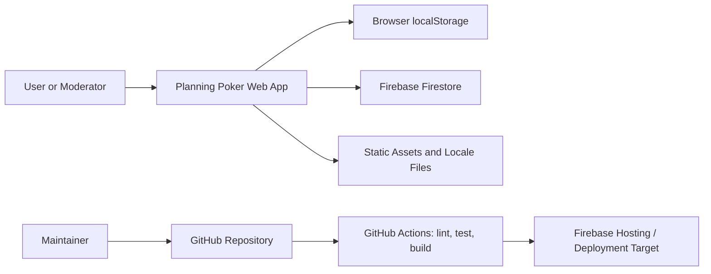
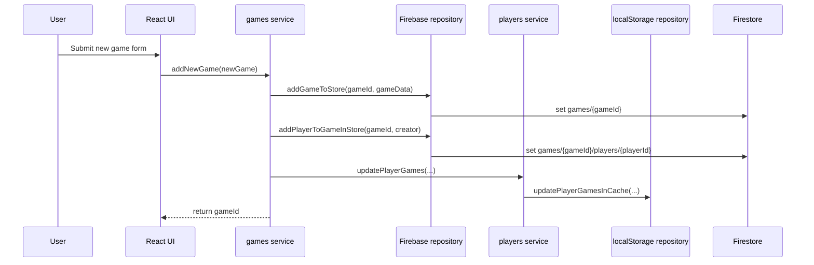
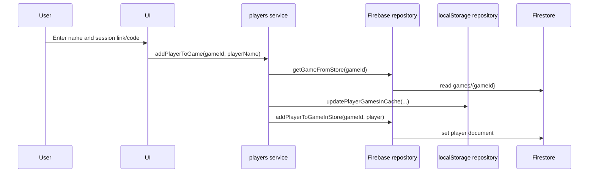

# Technical Architecture

## Architecture Summary

Planning Poker is a client-side React application built with Vite and TypeScript. It stores shared session state in Firebase Firestore and stores each user's recent game references in browser local storage. The application uses React Router for page navigation, Material UI for interface components, and i18next for localization.

## Technology Stack

| Layer | Technology | Purpose |
| --- | --- | --- |
| Application framework | React 19 | Component-based web UI |
| Language | TypeScript | Typed application code |
| Build tool | Vite | Local development server and production builds |
| UI library | Material UI | Shared UI components and styling primitives |
| Routing | React Router | Client-side page navigation |
| Data store | Firebase Firestore | Real-time game and player persistence |
| Local cache | Browser localStorage | Recent games and player identity per game |
| Localization | i18next, react-i18next | Multi-language UI |
| Testing | Vitest, Testing Library | Unit and component tests |
| Hosting | Firebase Hosting | Static site hosting with SPA rewrites |
| Container runtime | Docker, Nginx | Optional containerized production serving |

## System Context



## Application Structure

| Path | Responsibility |
| --- | --- |
| `src/index.tsx` | React application bootstrap. |
| `src/App.tsx` | Top-level application routing and global composition. |
| `src/pages/` | Page-level views such as Home, Game, Join, Guide, About, Examples, and Delete Old Games. |
| `src/components/` | Reusable UI components and Planning Poker feature components. |
| `src/service/` | Business logic for games, players, and theming. |
| `src/repository/` | Persistence adapters for Firebase Firestore and browser local storage. |
| `src/types/` | Shared TypeScript interfaces and enums. |
| `src/config/i18n.ts` | Localization configuration. |
| `public/locales/` | Translation JSON files. |
| `docs/` | Product, technical, operational, and user documentation. |

## Major Pages

| Page | File | Purpose |
| --- | --- | --- |
| Home | `src/pages/HomePage/HomePage.tsx` | Landing and entry point for creating or joining games. |
| Game | `src/pages/GamePage/GamePage.tsx` | Active session experience for voting and moderation. |
| Join | `src/pages/JoinPage/JoinPage.tsx` | Flow for entering an existing game. |
| Guide | `src/pages/GuidePage/GuidePage.tsx` | User guidance and product education. |
| Examples | `src/pages/ExamplesPage/ExamplesPage.tsx` | Example content. |
| About | `src/pages/AboutPage/AboutPage.tsx` | Project/about information. |
| Delete Old Games | `src/pages/DeleteOldGames/DeleteOldGames.tsx` | Maintenance utility for removing old sessions. |

## Core Components

| Component Area | Responsibility |
| --- | --- |
| `Poker` | Main planning poker workflow composition. |
| `CreateGame` | Collects new session details and card configuration. |
| `JoinGame` | Adds a participant to an existing session. |
| `RecentGames` | Displays locally cached recent sessions. |
| `GameArea` | Coordinates active session UI. |
| `GameController` | Moderator controls such as reveal, reset, and delete. |
| `Players` and `PlayerCard` | Displays participants, voting state, and revealed values. |
| `CardPicker` | Allows a participant to select an estimate. |
| `TshirtSummary` and `TshirtLegend` | Support T-shirt estimation workflows. |
| `Toolbar`, `Footer`, `LanguageControl` | Shared application shell controls. |

## Data Model

### Game

A game represents one estimation session.

```ts
interface Game {
  id: string;
  name: string;
  average: number;
  gameStatus: Status;
  gameType?: GameType;
  isAllowMembersToManageSession?: boolean;
  cards: CardConfig[];
  createdBy: string;
  createdById: string;
  createdAt: Date;
  updatedAt?: Date;
  isLocked?: boolean;
}
```

### Player

A player represents one participant inside a game.

```ts
interface Player {
  name: string;
  id: string;
  status: Status;
  value?: number;
  emoji?: string;
}
```

### PlayerGame

`PlayerGame` is stored in local browser cache to track recently used sessions and the current browser's player identity.

```ts
interface PlayerGame {
  id: string;
  name: string;
  isAllowMembersToManageSession?: boolean;
  createdById: string;
  createdBy: string;
  playerId: string;
  isModerator?: boolean;
  isLocked?: boolean;
  existsInStore?: boolean;
}
```

### Status Values

| Status | Meaning |
| --- | --- |
| `Not Started` | A player has not voted in the current round. |
| `Started` | A game has started and is ready for votes. |
| `In Progress` | At least one player has voted. |
| `Finished` | A player has voted, or a game has been revealed. |

## Firestore Structure

```text
games/{gameId}
  id
  name
  average
  gameStatus
  gameType
  isAllowMembersToManageSession
  cards
  createdBy
  createdById
  createdAt
  updatedAt
  isLocked

games/{gameId}/players/{playerId}
  id
  name
  status
  value
  emoji
```

## Local Storage Structure

| Key | Stored Value | Purpose |
| --- | --- | --- |
| `playerGames` | JSON array of `PlayerGame` objects | Lets a browser remember sessions and its player IDs. |

## Data Flow

### Create Game



### Join Game



### Vote And Reveal

1. A player selects a card.
2. `updatePlayerValue` updates the player with `value`, `emoji`, and `Finished` status.
3. `updateGameStatus` derives game status from player statuses.
4. Firestore listeners update connected browsers.
5. The moderator reveals the game through `finishGame`.
6. `finishGame` calculates the average from finished players with non-negative values.
7. Game status changes to `Finished`.

## Service API Structures

The app does not expose a REST API. The service layer acts as the internal application API.

### Game Service

| Function | Purpose | Notes |
| --- | --- | --- |
| `addNewGame(newGame)` | Creates a game and creator player. | Generates ULIDs for game and player. |
| `streamGame(id)` | Returns Firestore document reference for real-time game data. | Consumed by UI listeners. |
| `streamPlayers(id)` | Returns Firestore collection reference for real-time player data. | Consumed by UI listeners. |
| `getGame(id)` | Fetches one game. | Returns `undefined` when missing. |
| `updateGame(gameId, updatedGame)` | Updates selected game fields. | Delegates to Firestore `updateDoc`. |
| `resetGame(gameId)` | Resets average, game status, and player statuses. | Used between estimation rounds. |
| `finishGame(gameId)` | Reveals game and calculates average. | Uses finished player values. |
| `removeGame(gameId)` | Deletes an unlocked game and local cache reference. | Does nothing when `isLocked` is true. |
| `deleteOldGames()` | Removes games older than the configured threshold. | Current threshold is six months. |

### Player Service

| Function | Purpose | Notes |
| --- | --- | --- |
| `addPlayer(gameId, player)` | Adds a player when the game exists. | Lower-level add helper. |
| `addPlayerToGame(gameId, playerName)` | Creates and stores a new player for a joining user. | Updates local recent games. |
| `removePlayer(gameId, playerId)` | Removes a player from a game. | Requires game to exist. |
| `updatePlayerValue(gameId, playerId, value, randomEmoji)` | Stores a vote and marks the player as finished. | Triggers game status recalculation. |
| `updatePlayerName(gameId, playerId, name)` | Renames a player. | Updates Firestore player document. |
| `getPlayerRecentGames()` | Reads local games and validates them against Firestore. | Adds existence, lock, and moderator metadata. |
| `getCurrentPlayerId(gameId)` | Finds current browser's player ID for a game. | Reads local cache. |
| `isCurrentPlayerInGame(gameId)` | Checks whether cached player still exists. | Removes stale cache entries. |
| `resetPlayers(gameId)` | Clears player votes for a new round. | Sets `value` to `-3` and status to `Not Started`. |

## Configuration

Firebase configuration is read from Vite environment variables:

```text
VITE_FB_API_KEY
VITE_FB_AUTH_DOMAIN
VITE_FB_PROJECT_ID
VITE_FB_STORAGE_BUCKET
VITE_FB_MESSAGING_SENDER_ID
VITE_FB_APP_ID
VITE_FB_MEASUREMENT_ID
```

Use `.env.example` as the local template.

## Security And Privacy Notes

- The app currently does not implement user authentication.
- Firestore access control depends on Firebase project security rules.
- Browser local storage contains recent session references and player IDs.
- Avoid storing sensitive business information in game names until retention and access rules are confirmed.
- `[Placeholder: Document production Firestore security rules and deployment ownership.]`

## Architecture Risks And Follow-Ups

- Firestore deletion logic should be reviewed for consistency when deleting game documents and subcollection documents.
- `createdAt` type handling should be verified across Firestore `Timestamp` values and JavaScript `Date` values.
- Moderator authorization is enforced in the client experience; Firestore security rules should enforce any required server-side constraints.
- Historical reporting and export workflows are not yet implemented.

