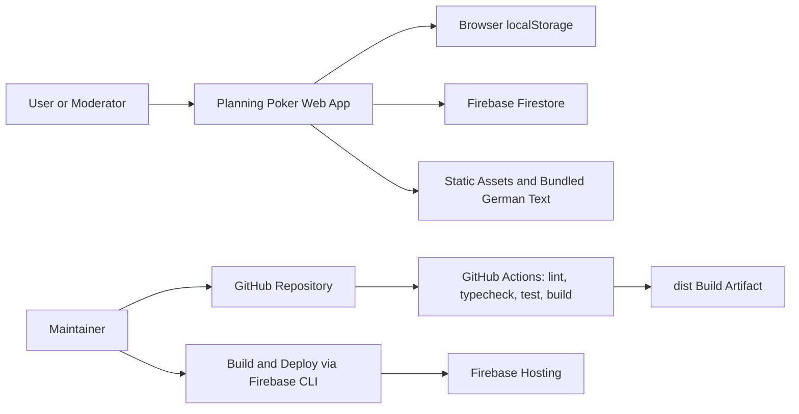
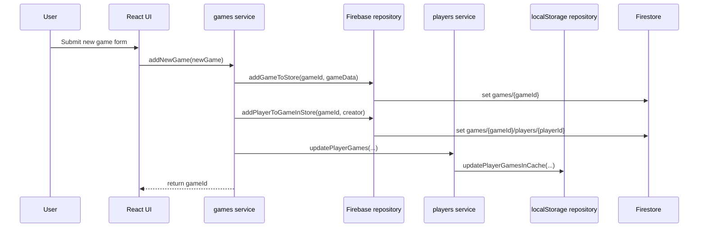

# Technical Architecture

## Architecture Summary

Planning Poker is a client-side React application built with Vite and TypeScript. It stores shared session state in Firebase Firestore and stores each user's recent game references in browser local storage. The application uses React Router for page navigation, Material UI for interface components, and i18next for bundled German UI text.

## Technology Stack

| Layer | Technology | Purpose |
| --- | --- | --- |
| Application framework | React 19 | Component-based web UI |
| Language | TypeScript | Typed application code |
| Build tool | Vite | Local development server and production builds |
| UI library | Material UI | Shared UI components and styling primitives |
| Routing | React Router | Client-side page navigation |
| Data store | Firebase Firestore | Real-time game and player persistence |
| Local cache | Browser localStorage | Recent games and player identity per game |
| Localization | i18next, react-i18next | German resources compiled into the bundle |
| Testing | Vitest, Testing Library | Unit and component tests |
| Hosting | Firebase Hosting | Static site hosting with SPA rewrites |
| Container runtime | Docker, Nginx | Optional containerized production serving |

## System Context


```mermaid
flowchart LR
    User["User or Moderator"] --> Browser["Planning Poker Web App"]
    Browser --> LocalStorage["Browser localStorage"]
    Browser --> Firestore["Firebase Firestore"]
    Browser --> Assets["Static Assets and Bundled German Text"]
    Maintainer["Maintainer"] --> GitHub["GitHub Repository"]
    GitHub --> CI["GitHub Actions: lint, typecheck, test, build"]
    CI --> Artifact["dist Build Artifact"]
    Maintainer --> Deploy["Build and Deploy via Firebase CLI"]
    Deploy --> FirebaseHosting["Firebase Hosting"]
```

## Application Structure

| Path | Responsibility |
| --- | --- |
| `src/index.tsx` | React application bootstrap. |
| `src/App.tsx` | Top-level application routing and global composition. |
| `src/pages/` | Page-level views such as Home, Game, Join, Guide, About, and Examples. |
| `src/components/` | Reusable UI components and Planning Poker feature components. |
| `src/service/` | Business logic for games, players, statistics, timers, presence, and theming. |
| `src/repository/` | Persistence adapters for Firebase Firestore and browser local storage. |
| `src/types/` | Shared TypeScript interfaces and enums. |
| `src/config/i18n.ts` | Localization configuration. |
| `src/locales/de.ts` | Bundled German translation resource. |
| `src/utils/` | Shared hooks, timestamp conversion, and client moderator checks. |
| `scripts/` | Firestore session listing, locking, unlocking, and deletion commands. |
| `docs/` | Product, technical, operational, and user documentation. |

## Major Pages

| Page | File | Purpose |
| --- | --- | --- |
| Home | `src/pages/HomePage/HomePage.tsx` | Landing and entry point for creating or joining games. |
| Game | `src/pages/GamePage/GamePage.tsx` | Active session experience for voting and moderation. |
| Join | `src/pages/JoinPage/JoinPage.tsx` | Flow for entering an existing game. |
| Guide | `src/pages/GuidePage/GuidePage.tsx` | User guidance and product education. |
| Examples | `src/pages/ExamplesPage/ExamplesPage.tsx` | Example content. |
| About | `src/pages/AboutPage/AboutPage.tsx` | Project/about information. |

All page modules are lazy-loaded through `React.lazy` and one `Suspense` boundary in `App.tsx`. Routes are `/` (create), `/join` (join form on the home page), `/join/:id`, `/game/:id`, `/guide`, `/examples`, and `/about-planning-poker`. The wildcard route renders `HomePage`.

Vite groups Firebase, Material UI/Emotion, React, and remaining vendor code into separate chunks. Static content routes do not import Firestore; the home, join, and game routes do. The repository forces Firestore long polling with a 10-second timeout to accommodate proxies.

## Core Components

| Component Area | Responsibility |
| --- | --- |
| `Poker` | Main planning poker workflow composition. |
| `CreateGame` | Collects new session details and card configuration. |
| `JoinGame` | Adds a participant to an existing session. |
| `RecentGames` | Displays locally cached recent sessions. |
| `GameArea` | Coordinates active session UI. |
| `GameController` | Moderator controls such as reveal, reset, and delete. |
| `Players` and `PlayerCard` | Displays participants, voting state, revealed values, presence indicators, and outlier markers. |
| `CardPicker` | Allows a participant to select an estimate. |
| `NumericSummary` | Shows statistics of a revealed round for numeric decks. |
| `GameTimer` and `CountdownOverlay` | Optional round timer control and the full-screen countdown for the last ten seconds. |
| `TshirtSummary` and `TshirtLegend` | Support T-shirt estimation workflows. |
| `RoundStatus` and `VotingProgress` | Show vote counts and remaining time before reveal. |
| `ConsensusVerdict`, `DeviationKpi`, `StatExplainer` | Explain result figures and consensus thresholds. |
| `Toolbar` and `Footer` | Navigation, light/dark/system theme selection, and application information. |

## Data Model

### Game

A game represents one estimation session.

```ts
interface Game {
  id: string;
  name: string;
  gameStatus: Status;
  gameType?: GameType;
  isAllowMembersToManageSession?: boolean;
  cards: CardConfig[];
  createdBy: string;
  createdById: string;
  createdAt: Date;
  updatedAt?: Date;
  isLocked?: boolean;
  timerDurationSeconds?: number;
  timerEndsAt?: Date | null;
}
```

`timerEndsAt` is the shared end of a running round timer and is `null` or absent whenever no timer runs. `timerDurationSeconds` keeps the last duration a moderator picked and is only used as the preselected menu entry. Firestore returns stored date fields such as `createdAt`, `updatedAt`, and `timerEndsAt` as `Timestamp` values despite the TypeScript `Date` annotations. `src/utils/toDate.ts` normalizes these values; `timerDurationSeconds` remains a number.

### Player

A player represents one participant inside a game.

```ts
interface Player {
  name: string;
  id: string;
  status: Status;
  value?: number;
  emoji?: string;
  lastSeenAt?: Date | null;
}
```

`lastSeenAt` is refreshed by the participant's own browser while the session is open. It is the only evidence that an entry still belongs to somebody, because a player document outlives the browser that created it.

### PlayerGame

`PlayerGame` is stored in local browser cache to track recently used sessions and the current browser's player identity.

```ts
interface PlayerGame {
  id: string;
  name: string;
  isAllowMembersToManageSession?: boolean;
  createdById: string;
  createdBy: string;
  playerId: string;
  isModerator?: boolean;
  isLocked?: boolean;
  existsInStore?: boolean;
  gameType?: GameType;
}
```

`getPlayerRecentGames()` enriches cached entries with existence, lock, moderator, and deck metadata. In particular, `gameType` is read from the session rather than the cache.

### Status Values

| Status | Meaning |
| --- | --- |
| `Not Started` | A player has not voted in the current round. |
| `Started` | A game has started and is ready for votes. |
| `In Progress` | At least one player has voted. |
| `Finished` | A player has voted, or a game has been revealed. |

## Firestore Structure

```text
games/{gameId}
  id
  name
  gameStatus
  gameType
  isAllowMembersToManageSession
  cards
  createdBy
  createdById
  createdAt
  updatedAt
  isLocked
  timerDurationSeconds
  timerEndsAt

games/{gameId}/players/{playerId}
  id
  name
  status
  value
  emoji
  lastSeenAt
```

## Local Storage Structure

| Key | Stored Value | Purpose |
| --- | --- | --- |
| `playerGames` | JSON array of `PlayerGame` objects | Lets a browser remember sessions and its player IDs. |
| `planning-poker-theme` | `light`, `dark`, or `system` | Persists the theme preference; defaults to `system`. |

The privacy consent is stored separately in the `planning-poker-privacy` cookie for 90 days. Recent-session storage does not implement offline session persistence.

## Data Flow

### Create Game


```mermaid
sequenceDiagram
    participant User
    participant UI as React UI
    participant GameService as games service
    participant FirebaseRepo as Firebase repository
    participant PlayerService as players service
    participant CacheRepo as localStorage repository
    participant Firestore

    User->>UI: Submit new game form
    UI->>GameService: addNewGame(newGame)
    GameService->>FirebaseRepo: addGameToStore(gameId, gameData)
    FirebaseRepo->>Firestore: set games/{gameId}
    GameService->>FirebaseRepo: addPlayerToGameInStore(gameId, creator)
    FirebaseRepo->>Firestore: set games/{gameId}/players/{playerId}
    GameService->>PlayerService: updatePlayerGames(...)
    PlayerService->>CacheRepo: updatePlayerGamesInCache(...)
    GameService-->>UI: return gameId
```

### Join Game

```mermaid
sequenceDiagram
    participant User
    participant UI
    participant PlayerService as players service
    participant FirebaseRepo as Firebase repository
    participant CacheRepo as localStorage repository
    participant Firestore

    User->>UI: Open invite or enter session ID
    UI->>UI: Load game and validate cached player in parallel
    User->>UI: Submit display name
    UI->>PlayerService: addPlayerToGame(game, playerName)
    PlayerService->>CacheRepo: updatePlayerGamesInCache(...)
    PlayerService->>FirebaseRepo: addPlayerToGameInStore(game.id, player)
    FirebaseRepo->>Firestore: set player document (background)
    PlayerService-->>UI: return immediately
    UI->>UI: Navigate to game; local snapshots include the new player
```

The join form reuses the loaded `Game` instead of reading it again in the service. A persisted cached player redirects straight to the game. While validation runs, the UI shows a checking state and adds a slow-connection hint after eight seconds. A failed background player write is logged.

### Vote And Reveal

1. A player selects a card.
2. `updatePlayerValue(gameId, playerId, value, randomEmoji, gameStatus)` writes `value`, `emoji`, and `Finished` status directly, without reading the player first.
3. If the caller's game snapshot is `Started`, the same function changes the game to `In Progress`.
4. Firestore listeners update connected browsers.
5. The moderator or an expired round timer reveals the game through `finishGame`.
6. Game status changes to `Finished`.
7. `GameArea` derives the round statistics through `getNumericSummary` for numeric decks and renders `NumericSummary`.

The card picker is disabled after reveal until reset. Hiding votes is a UI rule: player documents already contain the selected values before reveal.

No result of a round is persisted. Every figure is derived from the player documents on each render, so it cannot drift from the votes it describes. Storing a result would mean writing it at one moment in time; a vote arriving in that same moment would leave a stored value that no longer matches any card on the table.

### Round Timer

The round timer is optional. Nothing counts down until a moderator picks a duration, and stopping the timer or leaving it unused keeps the previous workflow unchanged.

1. A moderator picks a duration in `GameTimer`; `startTimer` stores `timerEndsAt` and `timerDurationSeconds`.
2. Firestore listeners deliver `timerEndsAt` to every participant, so all browsers count down towards the same moment.
3. `useCountdown` ticks locally four times per second; `GameArea` passes the remaining time to `GameController` and renders `CountdownOverlay` for the last ten seconds.
4. On expiry, every browser is a candidate, but they act one after another: `getTimerTakeoverDelayMs` gives each participant a turn, 750 ms apart and capped at 4 s.
5. The browser whose turn comes first calls `finishGame` when the round has votes (`In Progress`), otherwise `stopTimer`. This matches the rule of the Reveal button, which is disabled for a round without votes.
6. The resulting status change reaches the other browsers before their own turn and cancels it, so the normal case still produces a single write.
7. `finishGame`, `resetGame`, and `stopTimer` all clear `timerEndsAt`.

The takeover order uses vote status and player ID, not the presence heartbeat. A player document survives its browser, so choosing one fixed participant could leave nobody to reveal the round. Voters take their turn first, followed by other players; all delays are capped at four seconds. At least one browser with the session open must execute the expiry effect and reach Firestore.

Each browser uses its own clock, so clock differences affect both the displayed countdown and when that browser attempts to reveal. The first successful write synchronizes the shared state. Staggering reduces duplicate writes but does not guarantee exactly-once execution: slow delivery or equal capped delays can produce repeated writes of the same finished state.

## Service API Structures

The app does not expose a REST API. The service layer acts as the internal application API.

### Game Service

| Function | Purpose | Notes |
| --- | --- | --- |
| `addNewGame(newGame)` | Creates a game and creator player. | Generates ULIDs for game and player. |
| `streamGame(id)` | Returns Firestore document reference for real-time game data. | Consumed by UI listeners. |
| `streamPlayers(id)` | Returns Firestore collection reference for real-time player data. | Consumed by UI listeners. |
| `getGame(id)` | Fetches one game. | Returns `undefined` when missing. |
| `updateGame(gameId, updatedGame)` | Updates selected game fields. | Delegates to Firestore `updateDoc`. |
| `resetGame(gameId)` | Resets game status and player statuses. | Used between estimation rounds, clears a running timer. |
| `finishGame(gameId)` | Reveals the round. | Sets the status to `Finished` and clears a running timer. Results are derived, not stored. |
| `startTimer(gameId, durationSeconds)` | Starts the optional round timer. | Stores the shared end time and the chosen duration. |
| `stopTimer(gameId)` | Stops a running round timer. | Clears the shared end time without revealing. |
| `removeGame(gameId)` | Deletes an unlocked game and local cache reference. | Does nothing when `isLocked` is true. |

### Player Service

| Function | Purpose | Notes |
| --- | --- | --- |
| `addPlayer(gameId, player)` | Adds a player when the game exists. | Lower-level add helper. |
| `addPlayerToGame(game, playerName)` | Registers a player using an already loaded game. | Returns `void`; updates local cache and starts a background write, logging failures. |
| `removePlayer(gameId, playerId)` | Removes a player from a game. | Requires game to exist. |
| `updatePlayerValue(gameId, playerId, value, randomEmoji, gameStatus)` | Stores a vote directly and marks the player as finished. | Changes a `Started` game to `In Progress` using the caller's snapshot. |
| `updatePlayerName(gameId, playerId, name)` | Renames a player. | Updates Firestore player document. |
| `getPlayerRecentGames()` | Reads local games and validates them against Firestore. | Adds existence, lock, and moderator metadata. |
| `getCurrentPlayerId(gameId)` | Finds current browser's player ID for a game. | Reads local cache. |
| `isCurrentPlayerInGame(gameId)` | Checks whether cached player still exists. | Removes stale cache entries. |
| `resetPlayers(gameId)` | Clears player votes for a new round. | Sets `value` to `-3` and status to `Not Started`. |

### Statistics Service

`src/service/statistics.ts` derives read-only round statistics for numeric decks. It has no persistence and no side effects.

| Function | Purpose | Notes |
| --- | --- | --- |
| `isNumericGameType(gameType)` | Marks decks whose card values are real estimates. | Accepts Fibonacci variants, custom, and an absent type for legacy default decks. Unknown or removed types are excluded; `getNumericSummary` separately validates card labels. |
| `getNumericSummary(game, players)` | Full statistics of a revealed round. | Returns `undefined` before reveal, without valid numeric votes, or when card labels do not match their values. The UI shows an empty result state when no summary is available. |
| `getNearestCard(numericCards, value)` | Card closest to a value. | Ties resolve to the higher card to avoid systematic under-estimation. |
| `isCriticalSpread(rankSpread, standardDeviation, voteCount)` | Shared critical-consensus rule. | Used by numeric and T-shirt summaries. |
| `getMedianIndexes(length)` | Index pair used for the median. | Shared with the calculation explanations. |
| `getMedian(sortedValues)` | Median of an ascending list. | Averages both middle values for even counts. |
| `formatNumber(value)` | Display helper. | Integers stay plain; other values get one decimal with a German decimal comma. |

Spread, consensus, and outliers are calculated on **card ranks**, not on raw values, because the distance between two Fibonacci values grows with their size.

| Consensus status | Condition | Meaning |
| --- | --- | --- |
| `consensus` | Rank spread of 0 or 1 | Estimate plausible. |
| `moderate-spread` | Rank spread of 2 | Short clarification recommended. |
| `critical-spread` | Rank spread of 3 or more, or more than two votes with a rank standard deviation above 1.5 | Discussion required. |

A vote is reported as an outlier when its rank is at least two positions away from the median rank and at least three valid numeric estimates were submitted.

### Presence Service

`src/service/presence.ts` decides which participants are currently taking part; `src/utils/usePresenceHeartbeat.ts` keeps the own entry current.

| Function or constant | Purpose | Notes |
| --- | --- | --- |
| `presenceHeartbeatMs` | Refresh interval of the own entry. | 30 s. One small write per open session every 30 s, plus mount/visibility refreshes. |
| `presenceTimeoutMs` | How long an entry stays active without a refresh. | 120 s. Generous, because browsers throttle timers in background tabs. |
| `isPlayerActive(player, nowMs, currentPlayerId)` | Whether one participant is present. | The own entry always counts as active; this browser is rendering the session. |
| `getActivePlayerIds(players, nowMs, currentPlayerId)` | Present participants of a session. | Consumed by `PlayerCard` for the presence indicator. |
| `updatePresence(gameId, playerId)` | Writes `lastSeenAt`. | Failures are swallowed; the next heartbeat corrects them. |
| `usePresenceHeartbeat(gameId, playerId)` | Runs the heartbeat for the open session. | Beats on mount, on the interval, and when the tab becomes visible again. |

Entries written before presence tracking existed have no `lastSeenAt` and are therefore shown as inactive until their browser refreshes them.

### Timer Service

`src/service/timer.ts` holds the shared timer rules; `src/utils/useCountdown.ts` provides the ticking React hook.

| Function or constant | Purpose | Notes |
| --- | --- | --- |
| `timerDurationsInSeconds` | Selectable round durations. | `30, 60, 90, 120, 180, 300`. |
| `countdownThresholdSeconds` | Start of the prominent countdown. | Ten seconds. |
| `toDate(value)` | Shared timestamp helper in `src/utils/toDate.ts`. | Accepts `Date`, Firestore `Timestamp`, number, and string. |
| `getTimerEndsAt(game)` | Reads the running timer end from a game. | `undefined` when no timer runs. |
| `getRemainingSeconds(remainingMs)` | Whole seconds left. | Rounds up, never below zero. |
| `formatClock(totalSeconds)` | `m:ss` display format. | Used for the menu and the running timer. |
| `getTimerTakeoverDelayMs(players, playerId)` | How long this browser waits before acting on an expired timer. | Voters first, then by player ID; 750 ms per turn, capped at 4 s. Unknown players act last. |
| `useCountdown(endsAt)` | Milliseconds left, ticking four times per second. | Returns `undefined` without a running timer. |

## Configuration

Firebase configuration is read from Vite environment variables:

```text
VITE_FB_API_KEY
VITE_FB_AUTH_DOMAIN
VITE_FB_PROJECT_ID
VITE_FB_STORAGE_BUCKET
VITE_FB_MESSAGING_SENDER_ID
VITE_FB_APP_ID
VITE_FB_MEASUREMENT_ID
```

Use `.env.example` as the local template.

## Security And Privacy Notes

- The app currently does not implement user authentication.
- Firestore access control depends on Firebase project security rules; no rules file is included in the repository.
- Votes are hidden visually before reveal, not withheld from client snapshots.
- Reveal, reset, timer management, and removal of other players use the client moderator check. The active-session delete control is available to all participants for unlocked sessions.
- Session maintenance uses CLI commands with the web SDK, not privileged admin credentials. There is no age-based deletion route or scheduled cleanup.
- Browser local storage contains recent session references and player IDs.
- Avoid storing sensitive business information in game names until retention and access rules are confirmed.
- `[Placeholder: Document production Firestore security rules and deployment ownership.]`

## Architecture Risks And Follow-Ups

- Firestore deletion logic should be reviewed for consistency when deleting game documents and subcollection documents.
- Stored date fields are typed as `Date` but read as Firestore `Timestamp`; use the shared conversion helper at read boundaries.
- Timer expiry depends on open clients, local clocks, and network delivery; no server-side scheduled reveal or transaction enforces exactly-once execution.
- Moderator authorization is enforced in the client experience; Firestore security rules should enforce any required server-side constraints.
- Historical reporting and export workflows are not yet implemented.

